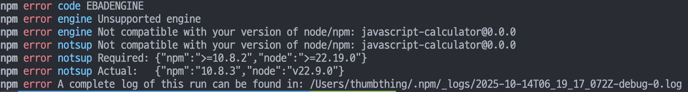
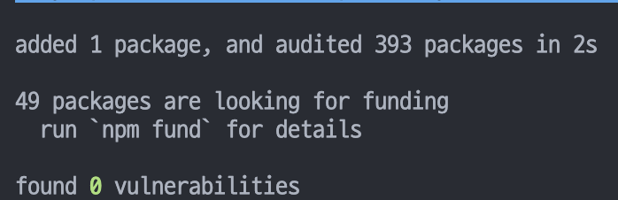

# npm install error

---

## 발생 상황

미션을 clone 후에 설치를 위해 `npm install` 명령어를 실행하였지만 설치가 되지 않고 에러가 발생


---

## 원인

로그를 살펴보니 `node`의 버전이 낮아서 설치가 제대로 실행되지 않은 것으로 파악됨

---

## 해결 방법

`nvm list`로 현재 pc에 설치되어 있는 node를 확인하여 미션 페키지와 호환이 되는 버전이 존재하는지 확인  
확인 결과 호환되는 버전이 존재하지 않아서 `lts` 버전을 설치하기로 결정  
`lts` 버전 설치 후 사용할 버전을 지정  

```zsh
nvm install --lts
nvm use v22.20.0
```

`npm install` 실행 후 정상 작동 확인

